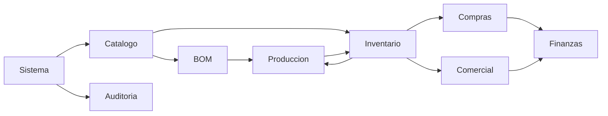
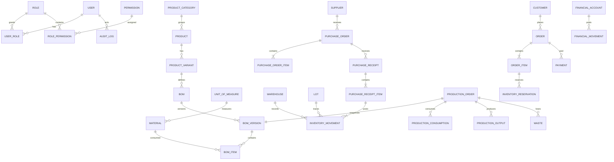
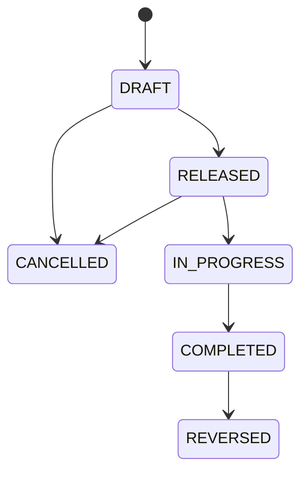
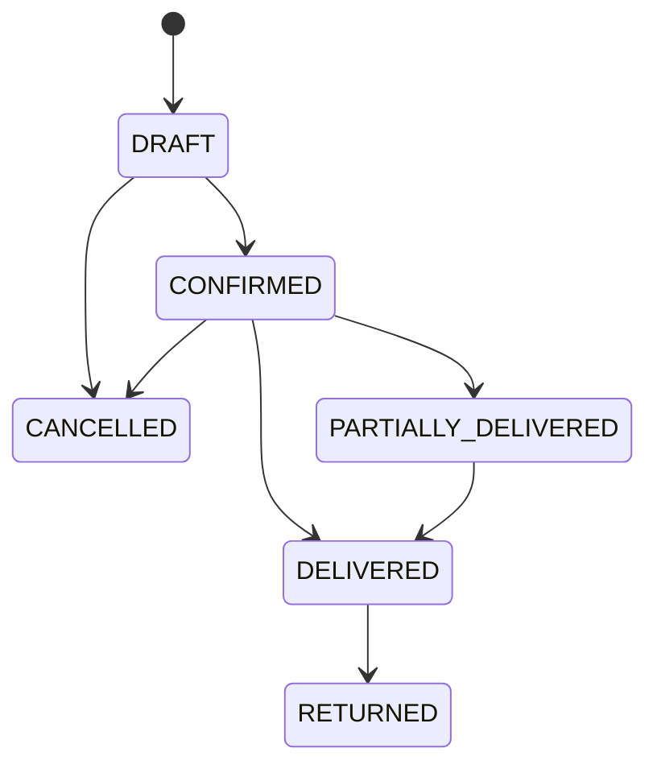

# LÚMINA OS — ERP Master Blueprint

**Versión:** 1.0  
**Estado:** Aprobado y autoritativo para MVP  
**Aprobación de LÚMINA:** 2026-09-02  
**Empresa:** LÚMINA Candle Studio  
**Fecha:** 2026-09-02  
**Moneda:** COP  
**Zona horaria:** America/Bogota

## 1. Resumen ejecutivo

LÚMINA OS será la fuente única de verdad para catálogo, materiales, recetas, inventario, compras, producción, ventas y finanzas gerenciales. Una operación se registra una vez y produce todos sus efectos dentro de una transacción. El MVP es interno, single-tenant y de un almacén. No incluye facturación DIAN, contabilidad de doble partida, portales de clientes, integraciones con WhatsApp/Instagram ni forecasting avanzado.

## 2. Principios obligatorios

1. Monolito modular en Next.js/TypeScript con PostgreSQL.
2. Inventario como ledger append-only; el stock se deriva.
3. BOM versionada e inmutable; producción conserva snapshot.
4. Costo Promedio Ponderado (CPP) para materiales.
5. Dinero con `numeric(14,2)` y cantidades con `numeric(18,6)`.
6. Timestamps UTC; presentación en America/Bogota.
7. Ninguna recomendación crea efectos reales sin confirmación humana.
8. Toda mutación comprueba sesión, permiso, estado e idempotencia.
9. Cancelaciones y correcciones generan reversos, no borrados.
10. Toda operación crítica genera auditoría y eventos después del commit.

## 3. Usuarios y RBAC

Un usuario físico puede tener varios roles funcionales.

| Recurso               | Admin                | Producción       | Ventas                  | Inventario         | Finanzas                 | Planeación                |
| --------------------- | -------------------- | ---------------- | ----------------------- | ------------------ | ------------------------ | ------------------------- |
| Usuarios/Roles        | Admin                | —                | —                       | —                  | —                        | —                         |
| Catálogo/BOM          | Admin                | View             | View                    | View               | View                     | View                      |
| Inventario            | Admin                | View/Create      | View                    | View/Create/Adjust | View                     | View                      |
| Compras               | Admin/Approve        | View             | —                       | View/Create        | View/Approve             | View                      |
| Producción            | Admin/Approve        | View/Create/Edit | View                    | View               | View                     | View                      |
| Ventas/Pedidos        | Admin/Approve/Cancel | View             | View/Create/Edit/Cancel | View               | View                     | View                      |
| Pagos/Gastos/Caja     | Admin/Approve        | —                | Create pagos            | —                  | View/Create/Edit/Approve | View                      |
| Planeación            | Admin                | View             | View                    | View               | View                     | View/Simulate/Recalculate |
| Auditoría/Exportación | Admin                | —                | —                       | —                  | View/Export              | View                      |

Acciones normalizadas: `view`, `create`, `edit`, `approve`, `cancel`, `adjust`, `export`, `simulate`, `recalculate`, `admin`.

## 4. Dominios y dependencias

- `sistema`: identidad, roles, permisos, configuración.
- `catalogo`: productos, variantes, categorías, materiales, unidades.
- `bom`: recetas y versiones.
- `inventario`: movimientos, reservas, lotes, saldos derivados.
- `compras`: proveedores, órdenes y recepciones.
- `produccion`: órdenes, consumos, outputs y mermas.
- `comercial`: clientes, pedidos, entregas y devoluciones.
- `finanzas`: pagos, gastos, cuentas, movimientos, costos y rentabilidad.
- `planning`: sólo después del MVP operacional.
- `auditoria`: registro inmutable transversal.

Los módulos no consultan tablas de otro módulo desde sus servicios de dominio; consumen interfaces públicas o eventos internos.

## 5. Modelo de datos

### 5.1 Sistema

- `users`: id, name, email único, email_verified, active, timestamps.
- `accounts`, `sessions`, `verifications`: modelos de Better Auth.
- `roles`: code único, name, system.
- `permissions`: resource + action únicos.
- `user_roles`, `role_permissions`: relaciones N:M.
- `invitations`: email, roles solicitados, token hash, expiration, accepted_at, invited_by.
- `audit_logs`: actor, entity_type, entity_id, action, before/after JSON, reason, occurred_at.
- `idempotency_keys`: scope + key únicos, request_hash, result JSON, expiry.

### 5.2 Catálogo y BOM

- `units_of_measure`: code, name, dimension, factor_to_base, active.
- `product_categories`: id, name, parent_id opcional, active.
- `products`: sku único, name, category_id, type `FINISHED|SERVICE`, active.
- `product_variants`: product_id, sku único, name, sale_price, active.
- `materials`: sku único, name, kind `RAW|PACKAGING|SUPPLY`, base_uom_id, minimum_stock, active.
- `boms`: product_variant_id, name, active.
- `bom_versions`: bom_id, version, status, yield_quantity, waste_rate, effective_from, approved_by, approved_at.
- `bom_items`: bom_version_id, material_id, quantity, uom_id, waste_rate.

### 5.3 Inventario y trazabilidad

- `warehouses`: un registro principal en MVP.
- `lots`: code único, item_type, material/product reference, received/produced_at, expiry_at opcional, status.
- `inventory_movements`: item, warehouse, lot, direction, quantity, unit_cost, source_type/id, reversal_of, occurred_at, confirmed_by.
- `inventory_reservations`: product_variant, warehouse, order_item, quantity, status.
- `inventory_balances`: vista/materialized query derivada; nunca fuente de verdad.

### 5.4 Compras y producción

- `suppliers`, `purchase_orders`, `purchase_order_items`, `purchase_receipts`, `purchase_receipt_items`.
- `production_orders`, `production_bom_snapshots`, `production_consumptions`, `production_outputs`, `wastes`.

### 5.5 Comercial y finanzas

- `customers`, `orders`, `order_items`, `deliveries`, `delivery_items`.
- `financial_accounts`, `payments`, `expenses`, `financial_movements`.
- Pagos y gastos se vinculan a su documento origen; movimientos financieros confirmados se revierten, no se editan.

### 5.6 Constraints e índices

- UUID en todas las PK; códigos/SKU únicos case-insensitive.
- Cantidades positivas; tasas entre 0 y 1; importes no negativos salvo reversos explícitos.
- Índices por estado/fecha y por todas las FK usadas en consultas.
- Un solo BOM `CURRENT` por variante.
- `source_type + source_id + source_line_id + movement_kind` único en movimientos para evitar duplicados.
- Un movimiento de reverso sólo puede apuntar a un movimiento confirmado no revertido.

## 6. ERD MVP

## 7. Reglas de negocio

### Sistema

- **RN-SIS-01:** no existe registro público; sólo una invitación vigente permite activar usuario.
- **RN-SIS-02:** un usuario inactivo no inicia sesión ni ejecuta mutaciones.
- **RN-SIS-03:** toda acción protegida requiere al menos un rol con el permiso exacto.
- **RN-SIS-04:** nadie puede retirar su propio último rol Administrador.
- **RN-AUD-01:** logs de auditoría son append-only y no se eliminan desde la aplicación.
- **RN-AUD-02:** inventario, costos, compras, producción, ventas y finanzas siempre se auditan.

### Catálogo y BOM

- **RN-CAT-01:** SKU de producto, variante y material es obligatorio y único sin distinguir mayúsculas.
- **RN-CAT-02:** entidades referenciadas se desactivan; no se eliminan físicamente.
- **RN-CAT-03:** toda cantidad usa una unidad compatible con la dimensión del material.
- **RN-BOM-01:** una versión `ACTIVE|EXPIRED` es inmutable.
- **RN-BOM-02:** editar una receta vigente crea una versión `DRAFT` consecutiva.
- **RN-BOM-03:** sólo una versión puede estar `ACTIVE` por variante.
- **RN-BOM-04:** una versión requiere al menos un componente, rendimiento positivo y componentes activos.
- **RN-BOM-05:** al hacer vigente una versión se retira la vigente anterior en la misma transacción.
- **RN-BOM-06:** producción guarda snapshot completo de la versión utilizada.

### Inventario

- **RN-INV-01:** el stock nunca se edita; es suma firmada de movimientos confirmados.
- **RN-INV-02:** un movimiento confirmado es inmutable.
- **RN-INV-03:** la corrección genera un movimiento inverso enlazado al original.
- **RN-INV-04:** no se confirma una salida si el disponible, descontando reservas, queda negativo.
- **RN-INV-05:** todo ajuste requiere motivo, usuario autorizado y evidencia opcional.
- **RN-INV-06:** un lote bloqueado o vencido no puede consumirse ni entregarse.
- **RN-INV-07:** una operación origen no puede contabilizar dos veces el mismo movimiento.

### Compras

- **RN-COM-01:** sólo órdenes `DRAFT` se editan; `APPROVED` habilita recepción.
- **RN-COM-02:** recepción acumulada no supera cantidad ordenada sin aprobación de tolerancia.
- **RN-COM-03:** confirmar recepción crea entrada de inventario, lote y obligación/movimiento financiero atómicamente.
- **RN-COM-04:** el CPP nuevo es `(valor stock anterior + valor recibido) / cantidad total`; si el stock anterior es cero, usa costo recibido.
- **RN-COM-05:** cancelar una orden recibida exige reversar primero sus recepciones.

### Producción

- **RN-PRO-01:** no se libera producción sin BOM `ACTIVE` válida.
- **RN-PRO-02:** consumos propuestos provienen del snapshot BOM × cantidad planificada.
- **RN-PRO-03:** iniciar producción reserva o descuenta materiales según configuración; el MVP descuenta al confirmar consumo.
- **RN-PRO-04:** finalizar exige consumos, output positivo y registro explícito de merma, incluso cero.
- **RN-PRO-05:** finalizar crea lote y entrada de producto terminado una sola vez.
- **RN-PRO-06:** costo real = consumos reales + empaque + mano de obra + indirectos + merma asignada.

### Ventas y finanzas

- **RN-VEN-01:** confirmar pedido reserva stock disponible.
- **RN-VEN-02:** entregar pedido convierte reservas en salidas de inventario y reconoce costo de venta.
- **RN-VEN-03:** pedido no se entrega por encima de cantidad confirmada ni con lotes bloqueados.
- **RN-VEN-04:** cancelar libera reservas; si hubo entrega requiere devolución/reverso.
- **RN-FIN-01:** pago confirmado crea exactamente un movimiento en la cuenta financiera.
- **RN-FIN-02:** gasto confirmado requiere cuenta, categoría, fecha e importe positivo.
- **RN-FIN-03:** movimientos financieros confirmados sólo se corrigen mediante reverso.
- **RN-FIN-04:** margen bruto = ingreso neto − costo de venta; porcentaje retorna nulo si ingreso neto es cero.
- **RN-FIN-05:** caja disponible es suma de movimientos confirmados por cuenta.

### Planning futuro

- **RN-PLA-01:** toda cifra futura se etiqueta `REAL|COMPROMETIDO|PROYECTADO|SIMULADO`.
- **RN-PLA-02:** proyecciones y simulaciones nunca modifican registros reales.
- **RN-PLA-03:** pedidos confirmados son demanda comprometida; cotizaciones no lo son.
- **RN-PLA-04:** toda recomendación muestra supuestos y requiere confirmación humana.

## 8. Máquinas de estado

## 9. Eventos de dominio

| Evento                    | Productor  | Consumidores                  | Datos mínimos                |
| ------------------------- | ---------- | ----------------------------- | ---------------------------- |
| UserInvited/UserActivated | Sistema    | Auditoría                     | user, roles, actor           |
| BOMVersionActivated       | BOM        | Producción, Auditoría         | BOM, version, actor          |
| InventoryMovementPosted   | Inventario | Alertas, Costos, Auditoría    | item, lot, qty, cost, source |
| StockBelowMinimum         | Inventario | Dashboard                     | item, available, minimum     |
| PurchaseApproved          | Compras    | Inventario, Finanzas          | purchase, supplier, totals   |
| PurchaseReceived          | Compras    | Inventario, Finanzas          | receipt, lines, actor        |
| ProductionStarted         | Producción | Inventario, Auditoría         | order, snapshot              |
| ProductionCompleted       | Producción | Inventario, Costos, Auditoría | output, lot, actual cost     |
| WasteRegistered           | Producción | Costos, Auditoría             | material, qty, reason        |
| OrderConfirmed            | Comercial  | Inventario, Dashboard         | order, lines                 |
| OrderDelivered            | Comercial  | Inventario, Finanzas          | delivery, lots, COGS         |
| PaymentReceived           | Finanzas   | Comercial, Dashboard          | payment, account, amount     |
| ExpenseCreated            | Finanzas   | Dashboard, Auditoría          | expense, category, amount    |

Los eventos se acumulan durante la transacción y se publican sólo después del commit. Los consumidores deben ser idempotentes.

## 10. Historias base

### HU-011 — Invitar y activar usuario

**Como** Administrador, **quiero** invitar una persona y asignarle uno o varios roles **para** que acceda sólo a sus funciones.

**Precondiciones:** administrador autenticado; correo no activo; al menos un rol.  
**Flujo:** crear invitación con expiración de 72 horas → enviar enlace → usuario define contraseña → verificar correo → activar roles → emitir `UserActivated`.  
**Alternativas:** invitación vencida se renueva; correo existente recibe cambio de roles, no otra cuenta.  
**Reglas:** RN-SIS-01, RN-SIS-02, RN-SIS-04, RN-AUD-01.

**Aceptación:**

- Given un administrador y correo nuevo, When invita con roles, Then se crea una invitación auditable y no una sesión activa.
- Given una invitación vigente, When el usuario define contraseña, Then se activa con exactamente los roles asignados.
- Given una invitación vencida o usada, When se intenta aceptar, Then se rechaza sin crear usuario.
- Given un no administrador, When intenta invitar, Then responde 403 y no cambia datos.

### HU-012 — Iniciar sesión y aplicar RBAC

**Como** usuario interno, **quiero** iniciar sesión **para** trabajar según mis responsabilidades.

**Precondiciones:** usuario activo, correo verificado, contraseña válida.  
**Flujo:** autenticar → crear sesión segura → cargar permisos combinados → mostrar módulos autorizados.  
**Reglas:** RN-SIS-02, RN-SIS-03, RN-AUD-01.

**Aceptación:**

- Given credenciales válidas, When inicia sesión, Then obtiene sesión segura y panel permitido.
- Given contraseña incorrecta, When inicia sesión, Then recibe error genérico y rate limit acumulado.
- Given usuario inactivo, When inicia sesión, Then no se crea sesión.
- Given sesión sin permiso, When invoca una API protegida, Then recibe 403 aun si ocultó el control de UI.

## 11. TOP 20 de implementación

1. **HU-011** Invitar y activar usuario.
2. **HU-012** Login, sesiones y RBAC.
3. **HU-013** Consultar auditoría.
4. **HU-014** Configurar empresa, almacén y unidades.
5. **HU-015** Gestionar productos, variantes y categorías.
6. **HU-016** Gestionar materiales e insumos.
7. **HU-001** Crear y versionar BOM.
8. **HU-018** Activar BOM y calcular costo estimado.
9. **HU-002** Registrar movimientos append-only e idempotentes.
10. **HU-020** Cargar conteo inicial.
11. **HU-021** Consultar disponible, reservado y mínimo.
12. **HU-025** Gestionar proveedores y orden de compra.
13. **HU-026** Aprobar orden de compra.
14. **HU-028** Recibir compra y recalcular CPP.
15. **HU-003** Crear orden de producción desde BOM.
16. **HU-030** Registrar consumo real y merma.
17. **HU-004** Finalizar producción y crear lote.
18. **HU-034** Crear cliente y pedido.
19. **HU-035** Confirmar, reservar y entregar pedido.
20. **HU-041** Registrar pago/gasto y consultar caja/margen.

Ordenado por dependencia: identidad → maestros → receta → ledger → abastecimiento → transformación → salida comercial → efecto financiero.

## 12. API pública

- Auth: `/api/auth/*` administrado por Better Auth.
- V1: `/api/v1/users`, `/roles`, `/audit`, `/products`, `/materials`, `/boms`, `/inventory`, `/suppliers`, `/purchases`, `/production-orders`, `/customers`, `/orders`, `/payments`, `/expenses`, `/accounts`, `/dashboard`.
- Listados: `page`, `pageSize≤100`, filtros explícitos y orden estable.
- Mutaciones: JSON validado, `Idempotency-Key` obligatorio para confirmaciones, códigos `400/401/403/404/409/422` consistentes.
- Respuesta de error: `{ code, message, fieldErrors?, correlationId }`.

## 13. Edge cases obligatorios

- Dos usuarios intentan reservar el último stock simultáneamente.
- Reintento de recepción, pago, entrega o finalización por timeout.
- Unidad incompatible o conversión inexistente.
- BOM vacía, componente inactivo, versión cambiada durante producción.
- Recepción parcial, sobre-recepción y costo anterior con stock cero.
- Consumo real superior al disponible; merma cero o superior a producción.
- Cancelación después de efectos parciales.
- Devolución de cliente de lote bloqueado o ya consumido.
- Precio/costo cero, margen con ingreso cero, reverso duplicado.
- Invitación vencida/usada, usuario desactivado con sesión abierta y último administrador.

## 14. Requerimientos no funcionales

- Disponibilidad objetivo MVP: 99.5% mensual.
- p95 de lecturas comunes <500 ms y mutaciones <1.5 s sin servicios externos.
- TLS, cookies Secure/HttpOnly/SameSite=Lax, secretos fuera del repositorio.
- Logs estructurados con correlationId; nunca contraseñas, tokens ni cadenas de conexión.
- Backups administrados por Neon y simulacro documentado de restauración antes de go-live.
- Accesibilidad WCAG 2.1 AA en flujos principales.
- Responsive desde 360 px; operación frecuente viable con teclado y táctil.

## 15. Carga inicial y salida

1. Completar plantillas de maestros.
2. Importar a Preview/branch de Neon y resolver errores sin cargas parciales.
3. Validar tres BOM contra cálculo manual.
4. Ejecutar conteo físico y saldos de apertura en fecha de corte.
5. UAT por rol y firma del propietario.
6. Congelar hojas paralelas, importar apertura, conciliar y publicar.
7. Mantener el sitio anterior sólo lectura durante estabilización.

## 16. Definition of Done

Una historia termina cuando tiene migración versionada, reglas activas, servicio/caso de uso, evento, auditoría cuando aplica, RBAC positivo/negativo, pruebas unitarias e integración, edge cases cubiertos, API/UI accesibles y suite completa verde.
